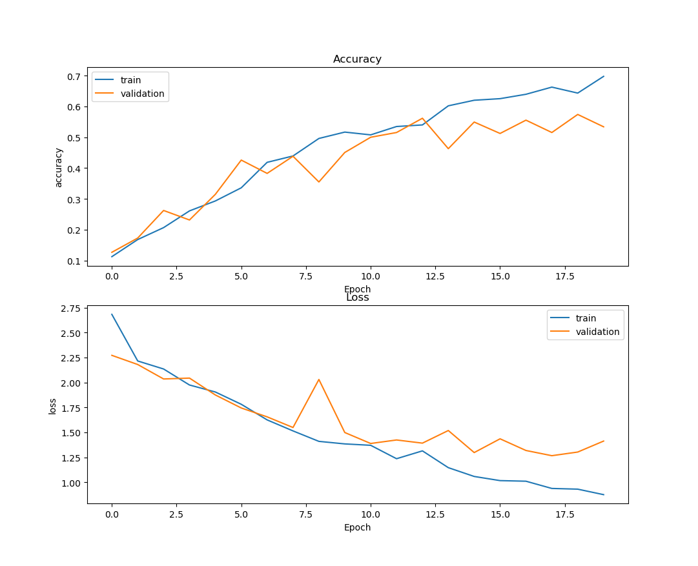
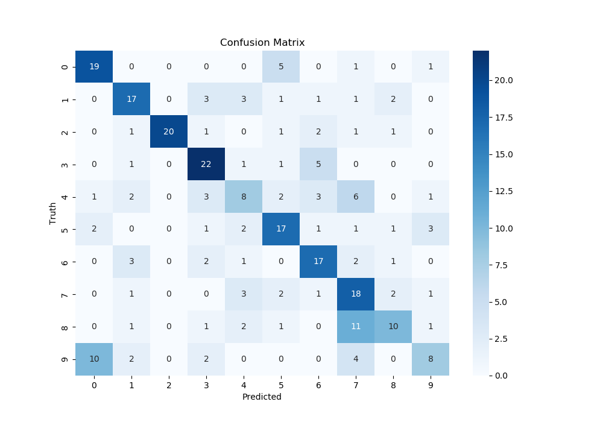
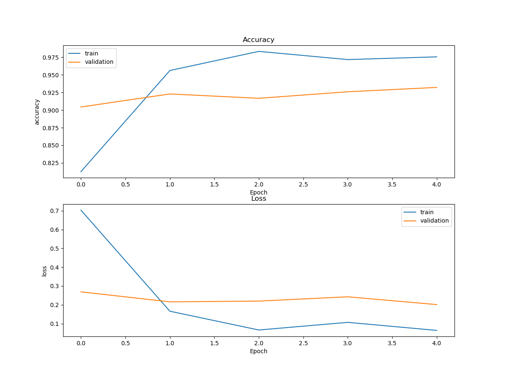

# Fine-Grain-Classification
## Overview
Fine-Grain Image Classification on monkey species using simple CNN and transfer learning.

## Dataset
[**10 Monkey Species**](https://www.kaggle.com/slothkong/10-monkey-species/home)

## To run the code
cd into root directory
### Simple CNN
```bash
python3 Code/main.py --Method simple_cnn
```
-  Parameters  
    - Method - method for classification. *Default :- 'tranfer_learning'*

### Tranfer learning
```bash
python3 Code/main.py --Method tranfer_learning
```
-  Parameters  
    - Method - method for classification. *Default :- 'tranfer_learning'*

## Results
### CNN
Accuracy | Confusion Matrix
:-:|:-:
 |  

### Tranfer Learning
 &nbsp; | Accuracy | Confusion Matrix
:-:|:-:|:-:
| w/o fine tune     | |  
| Fine tune | |  
